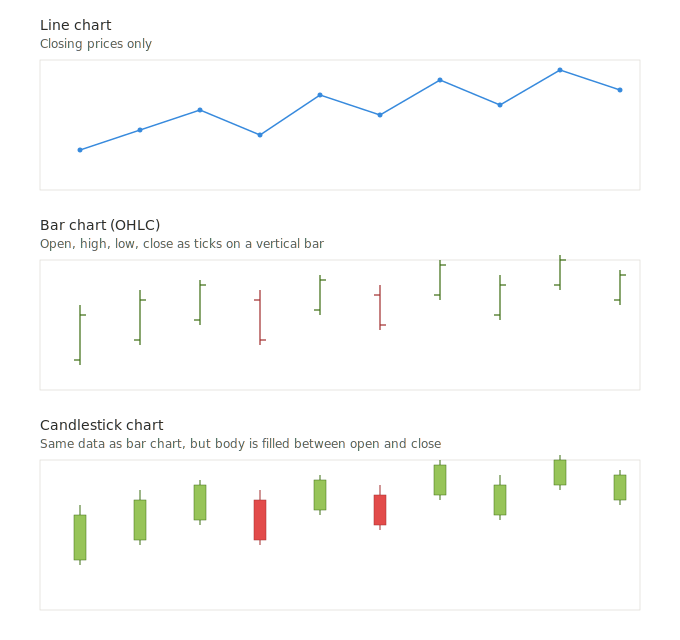
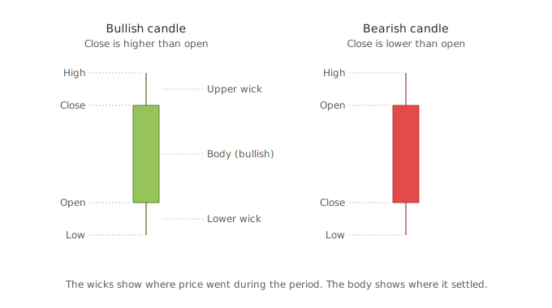

# Chapter 2 : The Basics

In chapter 1, I have learned that it is not an exact science and more of documented observations that have repeated over the course of history. I know that this is mostly the study of patterns that happen on the charts. My next question is what is the time frame on which a technical analysis has been found to be most useful ? What is the most appropriate chart time frame like 5 min charts, 1 min charts, 1 day charts etc and what is the most appropriate chart type like candlestick or a line graph and which one to use when ?

## Part 1: Which Timeframe?

There is no single "most useful" timeframe — it depends entirely on **what kind of trader or investor you are**. Technical analysis works across all timeframes, but each one suits a different style.

### Timeframes at a glance

| Timeframe | Typical User | Holding Period | What You're Reading |
|---|---|---|---|
| 1-min, 5-min | Scalpers | Seconds to minutes | Micro order flow, noise-heavy |
| 15-min, 1-hour | Day traders | Hours, closed by EOD | Intraday momentum and reversals |
| 4-hour, Daily | Swing traders | Days to weeks | Short-term trends, chart patterns |
| Weekly | Position traders | Weeks to months | Major trends, big patterns |
| Monthly | Long-term investors | Months to years | Secular trends, cycles |

### The widely accepted sweet spot for most learners is the daily chart

Here's why:
- One candle = one trading day, so noise is filtered out
- Most classical patterns (head and shoulders, double tops, flags) were documented on daily charts
- Enough history fits on screen to see context
- You don't need to watch screens all day

**As a beginner, start with daily charts.** Once you're comfortable reading them, you can zoom in (for entry timing) or zoom out (for broader context).

### The multi-timeframe principle

Professional analysts rarely look at just one timeframe. A common approach is the **"rule of three"**:

1. **Higher timeframe** — establishes the trend (e.g., weekly)
2. **Trading timeframe** — where you make decisions (e.g., daily)
3. **Lower timeframe** — fine-tunes your entry (e.g., 1-hour)

The idea: trade in the direction of the higher timeframe, using the lower one to time entries precisely. A stock in a weekly uptrend, pulling back on the daily, showing a reversal on the hourly — that's a high-confidence setup.

### A warning about very short timeframes

The shorter the timeframe, the more **noise** dominates over **signal**. A 1-minute chart is full of random fluctuations caused by individual large orders, bid-ask bounces, and algo activity. Patterns on 1-min and 5-min charts fail far more often than the same patterns on daily charts. Beginners who start on 1-min charts usually burn out fast. Don't start there.

---

## Part 2: Which Chart Type?

The three main chart types you'll encounter are **line, bar, and candlestick**. Each shows the same underlying price data but reveals different amounts of information.

### Line chart

A line chart simply connects the **closing prices** of each period. That's it — no highs, no lows, no opens.

**When to use it:**
- Quick glance at the overall trend
- Long-term charts (10+ years) where detail would be cluttered
- Comparing multiple stocks or indices on the same chart
- Reviewing pure trend direction without distraction

**Limitation:** You lose 75% of the price information. You can't see volatility, intraday reversals, or the relationship between open and close.

### Bar chart (OHLC chart)

A bar chart shows all four key prices in a single vertical bar:
- **Top of bar** = High
- **Bottom of bar** = Low
- **Tick on left** = Open
- **Tick on right** = Close

**When to use it:** Traditional Western technical analysis, especially in older textbooks. Still popular with some analysts. Shows full data but is harder to read at a glance.

### Candlestick chart

Candlesticks show the same OHLC data as bar charts but visually — which makes patterns jump out instantly.
- The **body** shows the range between open and close
- The **wicks** (or shadows) show the highs and lows
- A **green/white body** means close > open (bullish)
- A **red/black body** means close < open (bearish)

### Anatomy of a single candlestick

Notice how the same underlying data tells a much richer story in the candlestick version — you can instantly see which days were bullish vs. bearish, the size of each day's range, and where the "fight" between buyers and sellers happened.

---

## Which chart type should you use?

For technical analysis specifically, **candlesticks are the overwhelming standard today**. Here's why:

1. **Japanese candlesticks have a 300+ year documented history** (originally used by rice traders in 17th century Japan, introduced to the West by Steve Nison in the 1990s). An entire branch of pattern recognition — doji, hammer, engulfing, morning star, etc. — is built on candlestick formations.
2. **They're visually intuitive.** Green/red instantly tells you the sentiment of each period.
3. **Wicks tell a story.** A long upper wick means buyers pushed price up but sellers slapped it back down — that kind of information is invisible on a line chart.

### Rule of thumb

- **Use candlesticks** for 95% of your technical analysis work
- **Use line charts** when zooming out to decades of data, or comparing multiple instruments
- **Use bar charts** only if you personally find them easier to read (some traditional analysts still prefer them)

---

## Putting it together: your starting setup

For your learning journey, the default setup is:

1. **Chart type:** Candlestick
2. **Primary timeframe:** Daily
3. **Secondary timeframes:** Weekly (for context) and 1-hour (for entry timing) — to be introduced once you're comfortable with daily

As you progress through patterns in future chapters, we'll always default to daily candlesticks unless a specific pattern is better illustrated on another timeframe.

---

## Key terms introduced in this chapter

- **OHLC** — Open, High, Low, Close. The four prices that define any trading period.
- **Candle body** — The thick part of a candlestick, showing the range between open and close.
- **Wick / Shadow** — The thin lines above and below the body, showing the high and low.
- **Bullish candle** — Close higher than open (usually green or white).
- **Bearish candle** — Close lower than open (usually red or black).
- **Scalping / Day trading / Swing trading / Position trading** — Trading styles defined by holding period.
- **Multi-timeframe analysis** — Using multiple timeframes together to confirm a signal.
- **Noise vs. signal** — Random price movement vs. meaningful price movement. Shorter timeframes have more noise.

---

## Next chapter preview

The natural next step is **support and resistance** — the most foundational concept in all of technical analysis, and the bedrock on which every pattern rests.
