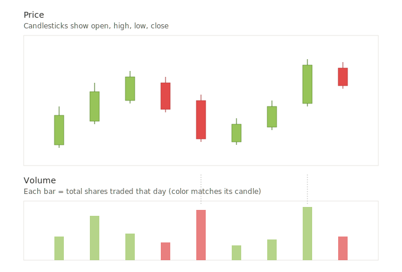
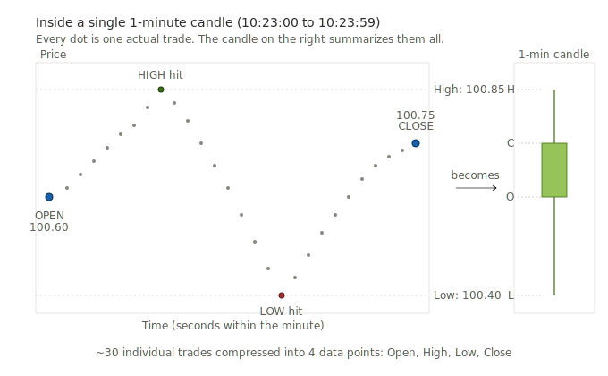

# Chapter 2 — Follow-up: Candle thickness, volume, and how candles are built on any timeframe

## Questions addressed in this follow-up
1. Does the thickness (width) of a candle imply volume?
2. If not, where is volume shown?
3. On a 1-minute chart, how do we have an "open" and "close"?

---

## Part 1: Does candle thickness represent volume?

**No — candle thickness does not represent volume.** This is a very common beginner assumption, so it's good to clarify early.

The width of every candle on a chart is **constant** — it's just a visual choice made by the charting software based on how many candles need to fit on your screen:
- Zoom in → all candles get wider
- Zoom out → all candles get thinner

The width carries **no information** about the market.

The only dimension of a candle that carries meaning is **vertical**:
- **Body height** = the distance between open and close (how decisively price moved)
- **Wick length** = how far price stretched beyond the open/close before settling

---

## Part 2: So where is volume shown?

Volume is almost always displayed as a **separate bar chart below the price chart** — called a **volume pane** or **volume histogram**. Each volume bar lines up directly underneath its corresponding candle.

### How to read the volume pane

- Each vertical bar = total number of shares traded during that candle's time period
- Bars are typically colored to match their candle (green for bullish, red for bearish)
- **Taller bar = more trading activity** during that period
- **Shorter bar = less trading activity**

### Why volume matters (preview)

Volume acts as a **confirmation tool** for price movement. Two quick principles that will come up later:

1. **A price move on high volume is more trustworthy** than a price move on low volume. If a stock breaks above a resistance level on huge volume, many participants are behind that move — it's more likely to hold.
2. **A price move on low volume is suspect.** If price is drifting up on thin volume, there may not be genuine buying interest — the move could easily reverse.

We'll dig deeper into volume analysis in a later chapter.

---

## Part 3: How does a 1-minute candle have an "open" and "close"?

### The universal principle

**Every candle — regardless of timeframe — summarizes the price activity over its entire time window.** The timeframe just changes how long that window is.

| Timeframe | Each candle covers | Open is... | Close is... |
|---|---|---|---|
| 1-minute | 60 seconds | Price at the first trade of that minute | Price at the last trade of that minute |
| 5-minute | 300 seconds | Price at the first trade of the 5-min block | Price at the last trade of the 5-min block |
| 1-hour | 3,600 seconds | Price at the first trade of that hour | Price at the last trade of that hour |
| Daily | ~6.5 hours (for US stocks) | Price at market open (9:30 AM ET) | Price at market close (4:00 PM ET) |

### How a 1-minute candle is built in real time

Let's say you're watching a stock at 10:23 AM. During that single minute — from 10:23:00 to 10:23:59 — hundreds (or thousands) of individual trades might execute at various prices.

Here's how the candle for that minute is constructed:

1. **Open** = The price of the very first trade that occurred at/after 10:23:00
2. **High** = The highest price any trade executed at during those 60 seconds
3. **Low** = The lowest price any trade executed at during those 60 seconds
4. **Close** = The price of the very last trade at/before 10:23:59

At 10:24:00, that candle is "sealed" (finalized), and a new candle begins forming for the 10:24 minute.

### How timeframes relate to each other

A single 1-hour candle contains the exact same information as 60 consecutive 1-minute candles — just summarized differently:
- **High of the hour candle** = the highest high across all 60 one-minute candles
- **Low of the hour candle** = the lowest low across all 60 one-minute candles
- **Open of the hour candle** = the open of the first 1-minute candle
- **Close of the hour candle** = the close of the last 1-minute candle

### A useful mental model

Think of each candle as a **"container"** that scoops up all the trading activity during its time window and reports back four key summary statistics. The timeframe just changes how big the scoop is.

- **Small scoop (1-min)** = you see every little wiggle, but lots of noise
- **Big scoop (daily)** = individual wiggles get smoothed out, you see the overall direction

### An important nuance: forming vs. closed candles

When you're watching a live 1-minute chart during market hours, the *current* forming candle is constantly changing — its body grows and shrinks, its wicks extend — because the close keeps updating with every new trade. Only when the minute officially ends does the candle "lock in" its final four values.

This is why experienced traders often **wait for a candle to close** before making a decision, rather than reacting to a forming candle that might reverse at the last second.

---

## Key terms introduced in this follow-up

- **Volume pane / Volume histogram** — The bar chart displayed below the price chart showing trading volume per period.
- **Volume** — The total number of shares (or contracts) traded during a given period.
- **Tick** — A single executed trade. Many ticks occur within each candle.
- **Candle close (verb sense)** — The moment a candle's time window ends and its values are finalized.
- **Forming candle** — The in-progress candle at the right edge of a live chart, whose values are still changing.
- **Sealed / Closed candle** — A candle whose time window has ended and whose OHLC values are now fixed.

---

## Summary takeaways

1. Candle **thickness is meaningless** — only vertical dimensions (body height, wick length) carry information.
2. **Volume lives in a separate pane** below the price chart, with one volume bar per candle.
3. **Every candle works the same way** regardless of timeframe: first trade = open, last trade = close, plus the highest and lowest prices hit during that window.
4. A candle is a **time-based container** that compresses many individual trades into four summary numbers (OHLC).
5. **Wait for candles to close** before making decisions — a forming candle can still change dramatically.