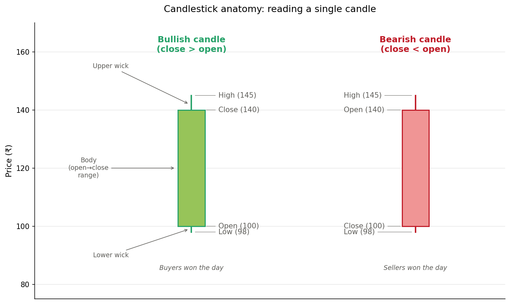
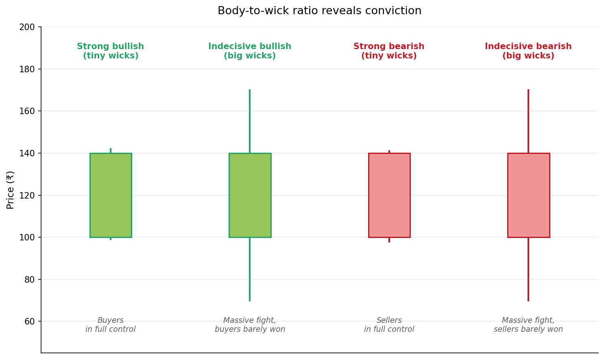
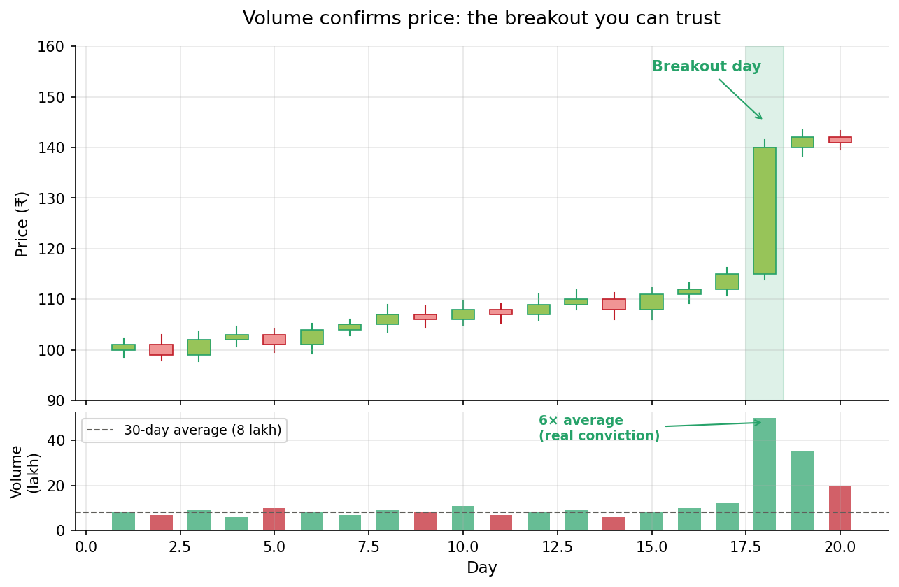
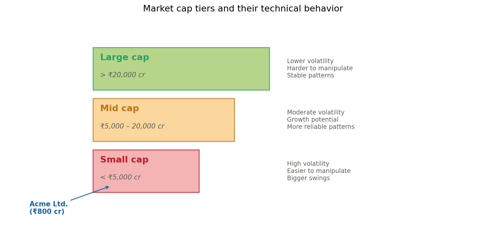
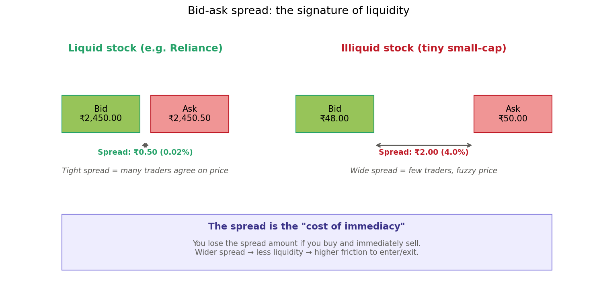
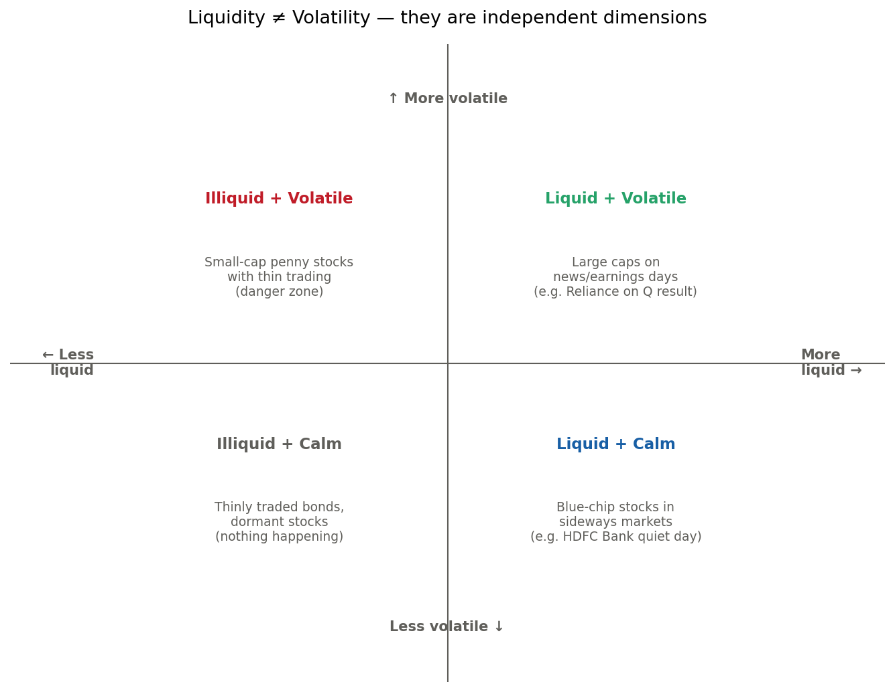

# Chapter 3 : Part 1 - Learning the different technical terms and the intuition behind them

In this chapter, I would first like to learn the different technical terms that are there and the intuition behind these terms. What they represent and how do they help ? Hearing their values should give me an indication that is necessary to evaluate a stock technically.

This chapter covers **Tier 1: Price & Volume Fundamentals** — the raw materials that every other indicator builds on.

- [1. Price (OHLC)](#1-price-ohlc)
- [2. Volume](#2-volume)
- [3. Market Capitalization](#3-market-capitalization-market-cap)
- [4. Liquidity & the Bid-Ask Spread](#4-liquidity--the-bid-ask-spread)
- [Worked Example: Acme Ltd.](#worked-example-acme-ltd)

---

## 1. Price (OHLC)

### What it is

When people say "the price of a stock," they usually mean the most recent traded price. But in technical analysis, a single price point is almost useless. What matters is how the price moved *over a period* — a day, an hour, a minute.

Every **candle** (or bar) on a chart represents four prices for that time period:

| Term | Meaning |
|---|---|
| **Open** | The price when the period started |
| **High** | The highest price reached during the period |
| **Low** | The lowest price reached |
| **Close** | The price when the period ended |

### Intuition

Imagine a single trading day. At 9:15 AM the stock opens at ₹100 (Open). During the day it shoots up to ₹108 (High), dips to ₹98 (Low), and finally settles at ₹105 when the market closes at 3:30 PM (Close). That whole day's story gets compressed into *one* candle: **100 / 108 / 98 / 105**.

### Anatomy of a candle

- **Body** = the rectangle between open and close
- **Wicks** (or shadows) = the thin lines above and below, extending to the high and low
- **Green/white** candle = close > open (buyers won)
- **Red/black** candle = close < open (sellers won)

### Reading the story in the wicks

The ratio of body to wicks tells you *how much conviction* there was behind the move:

- **Strong candle** (tiny wicks + big body) → one side was in full control all day
- **Indecisive candle** (big wicks + small/medium body) → massive fight, the winner barely emerged

**Example:** A green candle with Open 100, Close 140, High 142, Low 99 tells a very different story from one with Open 100, Close 140, High 170, Low 70. Same body, completely different day. The first says "buyers dominated smoothly." The second says "brutal fight, the price whipsawed between 170 and 70 before settling at 140."

### What the values tell you

When you look at a candle, ask:
1. Is **close > open** or the reverse? → Who won today?
2. How big is the **body** relative to the **wicks**? → How strong was the conviction?
3. Where does it sit relative to **yesterday's candle**? → Is momentum building or reversing?

---

## 2. Volume

### What it is

**Volume** = the number of shares traded during a period.

If price is *what* happened, volume is *how many people agreed*.

### Intuition

Imagine two scenarios where a stock rises 5% in a day:

- **Scenario A:** 10,000 shares changed hands
- **Scenario B:** 10,000,000 shares changed hands

Both show the same price move, but Scenario B is a much stronger signal. Lots of people bought at these prices — there's real conviction behind the move. Scenario A might just be a few traders pushing the price around in a quiet market.

### The golden rule

> **Volume confirms price.** A price move on high volume is trustworthy. A price move on low volume is suspicious.

In the chart above, notice how the stock drifted sideways for weeks on quiet volume, then on day 18 it jumped dramatically **on 6× the average volume**. That's a breakout worth trusting — real money is flowing in.

### What the values tell you

| Pattern | What it suggests |
|---|---|
| Price up + volume spike (2-3× avg) | Strong buying interest, likely to continue |
| Price down + volume spike | Panic selling or distribution — be careful |
| Price up + low volume | Weak/fake breakout, don't chase |
| Price down + low volume | Minor pullback, not necessarily a reversal |

**Rule of thumb:** Before believing any price move, glance at volume. If volume is below average, treat the move skeptically.

---

## 3. Market Capitalization (Market Cap)

### What it is

**Market Cap = Current Share Price × Total Number of Shares Outstanding**

It's the total price tag of the entire company if you wanted to buy it at the current share price.

**Example:** A company trading at ₹500 with 10 crore shares has a market cap of ₹5,000 crore.

### Why it matters technically

Market cap determines how a stock *behaves*. A pattern that's reliable on a large cap might be a trap on a small cap, because small caps can be moved by a single big trader.

| Category | Approx. Range (India) | Technical Behavior |
|---|---|---|
| **Large cap** | > ₹20,000 cr | Stable, lower volatility, harder to manipulate, patterns reliable |
| **Mid cap** | ₹5,000 – 20,000 cr | Moderate volatility, good growth potential, reasonably reliable |
| **Small cap** | < ₹5,000 cr | High volatility, easier to manipulate, bigger swings, patterns less reliable |

### What the values tell you

When you first look at a stock, **always note the market cap**. It tells you:
- How much to trust the patterns you see
- How big a position you can realistically take
- How much volatility to expect
- Whether news can move the stock dramatically (yes for small, no for large)

---

## 4. Liquidity & the Bid-Ask Spread

### What liquidity is

**Liquidity** = how easily you can buy or sell a stock *without moving its price*.

Think of selling a house vs selling ₹1,000 worth of gold. Gold is liquid — you convert it to cash in minutes at a fair price. A house is illiquid — it takes months, and if you're in a hurry, you slash the price.

In stocks, liquidity shows up as:
- **High average daily volume** → liquid (easy to enter/exit)
- **Tight bid-ask spread** → liquid (small gap between buy and sell prices)
- **Low average daily volume** → illiquid (your own order can move the price)

### The bid-ask spread — your first liquidity indicator

- **Bid** = the highest price *someone is willing to buy* at right now
- **Ask** = the lowest price *someone is willing to sell* at right now
- **Spread** = the gap between them

### Why the spread indicates liquidity

The spread is essentially **the market's price for immediacy** — the toll you pay to trade right now instead of waiting for a better price.

**In a liquid stock:**
- Thousands of buyers and sellers at every moment
- Market makers compete, driving spreads down
- They can flip positions quickly, so they need less risk compensation
- Result: spread might be 0.01–0.05% of price

**In an illiquid stock:**
- Few buyers and sellers
- Market makers who take a position might hold it for hours or days
- That waiting time = risk → they demand a wider spread as compensation
- Result: spread might be 2–5% of price or worse

> **In one line:** Tight spread = many people agree on the price right now. Wide spread = few people are trading, so the "fair price" is fuzzy.

### Mental rule for spread as % of price

| Spread as % of price | Liquidity verdict |
|---|---|
| < 0.1% | Very liquid (think large caps) |
| 0.1% – 0.5% | Decently liquid |
| 0.5% – 1% | Moderately liquid |
| 1% – 2% | Illiquid — be cautious |
| > 2% | Very illiquid — avoid unless there's a strong reason |

Always use **percentage of price**, not the absolute rupee amount:
- A ₹1 spread on a ₹50 stock = 2% (wide — illiquid)
- A ₹1 spread on a ₹2,000 stock = 0.05% (tight — liquid)

### Important: liquidity ≠ volatility

These are often confused. They are **independent dimensions**.

- **Liquidity** = how easily you can trade without moving the price
- **Volatility** = how much the price swings around

A stock can be liquid AND volatile (Reliance on an earnings day), or illiquid AND calm (a dormant stock). The bid-ask spread tells you about *liquidity*, not *volatility*.

### Caveats to remember

1. **Check volume alongside spread.** A tight spread with low volume can be misleading.
2. **Spreads widen in stress.** Even liquid stocks see spreads balloon during crashes or major news — a widening spread is also a volatility warning.
3. **"Today's" liquidity ≠ "typical" liquidity.** A volume spike can make an illiquid stock look liquid for one day. Check the 30-day average volume for the true picture.

---

## Worked Example: Acme Ltd.

Let's apply everything above to a concrete scenario.

### The data on your screen

| Metric | Value |
|---|---|
| Closing Price | ₹240 |
| Today's Open | ₹200 |
| Today's High | ₹245 |
| Today's Low | ₹198 |
| Today's Volume | 50 lakh shares |
| 30-day Average Volume | 8 lakh shares |
| Market Cap | ₹800 crore |
| Bid-Ask Spread | ₹239.50 / ₹240.80 |

### Step-by-step analysis

#### Step 1 — Read the candle

- **Close (240) > Open (200)** → bullish green candle
- **Body:** runs from 200 to 240 → a 20% gain in one day
- **Upper wick:** 240 → 245 (only ₹5) — tiny
- **Lower wick:** 200 → 198 (only ₹2) — tiny

**Story:** The stock opened at 200, barely dipped to 198 (almost no early selling), then climbed almost straight to 240, briefly poking 245 before closing. This is a **strong bullish candle with minimal wicks — buyers were in full control all day.**

#### Step 2 — Check volume

- Today: **50 lakh** vs 30-day average of **8 lakh**
- That's **~6× normal volume**

This isn't noise — it's a major event. The price move is backed by real participation. This kind of day is called a **high-volume breakout day** or **climactic volume day**.

**Next question to ask:** Where is this happening in the larger chart? Is it breaking out of a sideways range (get-in signal) or ending a long uptrend (exhaustion signal)? Context determines the interpretation.

#### Step 3 — Check market cap

- ₹800 crore → **small cap** (well below the ₹5,000 cr threshold)

This doesn't invalidate the move, but it demands **extra caution**:
- Small caps are easier for coordinated traders to move
- A 20% day on a small cap isn't as shocking as it would be on a large cap
- Patterns have lower success rates here

**Mental adjustment:** "I'll want additional confirmation — is this backed by news/earnings? Is the volume spike sustained over multiple days? Are institutions involved?"

#### Step 4 — Check liquidity

- Bid: ₹239.50, Ask: ₹240.80 → spread of **₹1.30**
- As a % of price: 1.30 / 240 = **~0.54%**
- That puts it in the **"moderately liquid"** bucket

**But there's a catch:** Today's volume is 6× normal. The spread looks good today because of the flood of trading. On a typical day (8 lakh volume), the spread might be wider. Before taking a position, think about how liquid this stock is on **ordinary** days, not just this one.

### Putting it together

> A strong bullish candle with minimal wicks, backed by 6× normal volume, on a small-cap stock that's moderately liquid today. The move looks real on the surface — but the small-cap nature demands additional confirmation before trusting it as the start of a sustained trend.

This is the kind of reasoning we'll keep building on. Every future indicator (moving averages, RSI, MACD, support/resistance) adds another lens to this core picture.

---

## Summary Cheat Sheet

| Concept | Core question it answers |
|---|---|
| **OHLC / Candle** | Who won today — buyers or sellers? How strong was the conviction? |
| **Volume** | How many people agreed with today's move? Is it trustworthy? |
| **Market cap** | How much can I trust the patterns on this stock? |
| **Liquidity / Spread** | Can I enter and exit without moving the price? |

---

**Next chapter preview (Tier 2):** Trend & momentum indicators — moving averages, support & resistance, trend definition, RSI, and MACD.