# Chapter 3 : Part 2 - Learning the different technical terms and the intuition behind them

Continuing from our previous discussion on the tier 1, I would like to know about more of these indicators that help me understand the factors which drive the trading decisions.

> **Foundation built on Tier 1.** This tier transforms how charts look to you. By the end, charts stop feeling like chaotic noise and start feeling like structured data with a clear underlying signal. These are **Tier 2 indicators : Trend & Momentum Indicators**


## Roadmap

| # | Concept | What it tells you |
|---|---|---|
| 1 | Trend | Which direction the market is moving |
| 2 | Support & Resistance | Where price pauses, bounces, or reverses |
| 3 | Moving Averages | The smoothed view of trend |
| 4 | RSI | Whether buyers or sellers are exhausted |
| 5 | MACD | Whether momentum is accelerating, decelerating, or reversing |

The order matters: trend is the foundation, support/resistance maps the terrain, moving averages help you see the trend, and RSI + MACD reveal the engine underneath.

---

## 1. Trend

### Intuition

Imagine watching someone walk. Over a minute they take a step back, pause, speed up, slow down — but if you zoom out, you can tell they're heading north, south, or pacing in place. Stock trend is the same thing. The daily noise is the individual steps; the trend is the overall direction.

**Why this matters so much:** trading against the trend is statistically a losing game. If a stock is in an uptrend, betting it'll fall is like betting against gravity. Almost every profitable strategy starts with "identify the trend, then trade with it."

### The three trend types

There are only three possibilities:

- **Uptrend** — making **higher highs and higher lows**. Every dip is shallower than the last peak; every peak is higher than the last.
- **Downtrend** — making **lower highs and lower lows**. Every bounce is weaker than the last dip; every dip is deeper than the last peak.
- **Sideways (range-bound)** — bouncing between roughly the same high and low. No clear direction.

> **The single most important definition in technical analysis:**
> Higher highs + higher lows = uptrend.
> Lower highs + lower lows = downtrend.

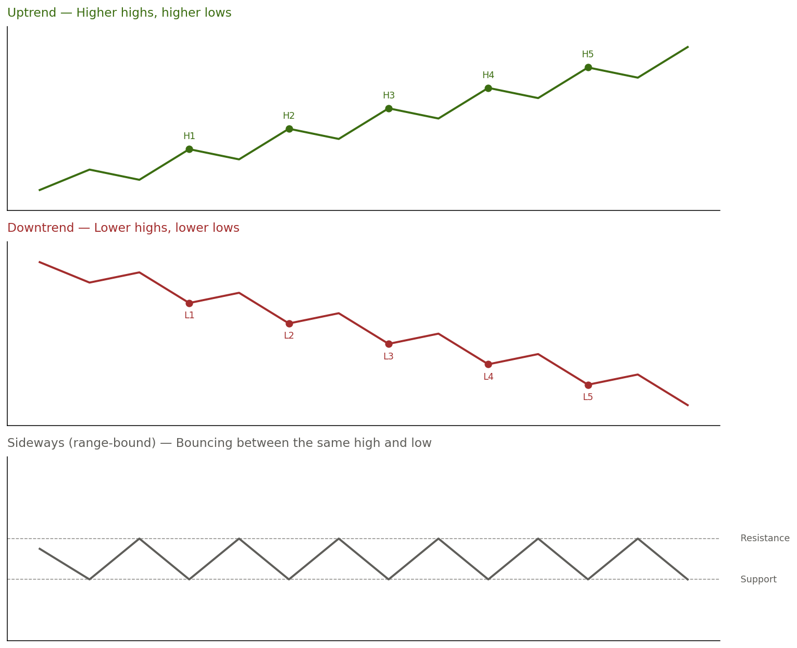

### The zoom-level trap

A stock can be in different trends at different timeframes simultaneously:

- Uptrend on the **weekly** chart (big picture)
- Downtrend on the **daily** chart (last few weeks)
- Sideways on the **hourly** chart (today)

All three can be true at once. **Which one matters?** The one matching your trading horizon. Long-term investor → weekly. Swing trader → daily. Day trader → hourly.

### How to identify a trend in practice

1. **Eyeball test** — draw a line from leftmost to rightmost point. Sloping up = uptrend.
2. **Swing point method** — mark peaks and valleys. Are peaks getting higher? Are valleys getting higher? Both yes → uptrend. Both no → downtrend. Mixed → sideways or transitioning.
3. **Trendline method** — connect at least two significant lows with a line. If price keeps respecting it, the uptrend is valid.

The swing point method is your workhorse.

### Two-piece confirmation rule

A single broken low isn't a confirmed reversal — it's a **warning**. To confirm a downtrend reversal from an uptrend, you need:

- A **lower low** (broken support pattern), AND
- A **lower high** afterward (weakened bounce)

Only when both appear together is the trend reversal confirmed. This rule prevents you from reacting to every dip as if the world is ending.

### Worked example — Titan Ltd.

Six swing points over three months:

| Date | Type | Price |
|---|---|---|
| Jan 10 | Low | ₹3,200 |
| Jan 25 | High | ₹3,450 |
| Feb 5 | Low | ₹3,280 |
| Feb 20 | High | ₹3,520 |
| Mar 1 | Low | ₹3,350 |
| Mar 15 | High | ₹3,600 |

Higher highs (3,450 → 3,520 → 3,600) and higher lows (3,200 → 3,280 → 3,350). Textbook **uptrend**.

**What if Titan drops to ₹3,300?** That's below the prior swing low of ₹3,350. The uptrend is now in question — but not yet broken. Three possible futures:

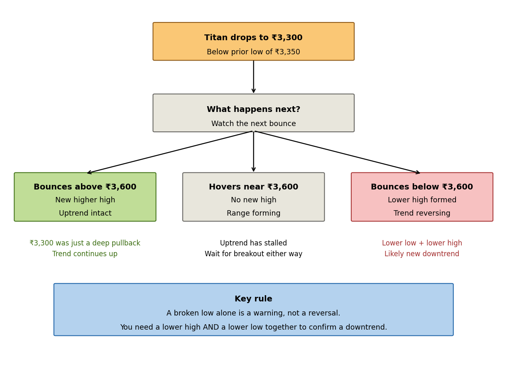

---

## 2. Support & Resistance

### Intuition

Imagine a ball bouncing in a room. It hits the floor and bounces back. It rises, hits the ceiling, comes back down. The floor and ceiling are physical boundaries.

In stock charts, the floors and ceilings are **psychological price levels** where enough buyers or sellers consistently show up to reverse direction.

- **Support** = the floor. Buyers consistently step in.
- **Resistance** = the ceiling. Sellers consistently step in.

### Why these levels exist

Three forces create them:

1. **Round-number psychology** — humans set orders at ₹100, ₹500, ₹1,000, not ₹103.47. Round numbers are natural levels.
2. **Previous turning points** — if a stock bounced off ₹240 three times last month, traders remember. Next approach to ₹240, some will buy expecting another bounce, *causing* the bounce. Self-fulfilling prophecy from memory.
3. **Trapped traders waiting to exit** — if buyers got stuck at ₹150 when price crashed, they'll sell to "break even" if price rallies back to ₹150. Old highs become new resistance.

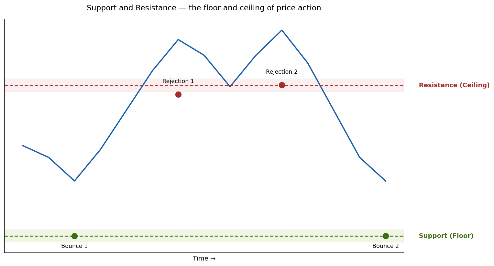

### Zone, not a line

Support and resistance are **zones**, not exact prices. Price might bounce off ₹497 once, ₹502 next, ₹499 the time after. Treat levels as bands roughly ±1–2% wide. This is why charts show shaded zones, not razor-thin lines.

### What makes a level strong

| Factor | Why |
|---|---|
| Multiple touches | One = coincidence. Two = worth watching. Three+ = strong, respected level. |
| High volume on bounces | Real buyers showing conviction (Tier 1 principle). |
| Held for a long time | A 6-month level matters more than a 1-week one. |
| Aligns with round number | ₹500 is psychologically stronger than ₹487. |

### The role-reversal rule (critical)

**When a level breaks, the two roles swap.**

- Old **resistance**, once broken, becomes new **support**.
- Old **support**, once broken, becomes new **resistance**.

This happens because of memory and trapped traders. A stock resists at ₹500 for months. Sellers waiting at ₹500 finally got their fill. Now price breaks above. Buyers who missed the move wait for it to come back to ₹500 to enter — *creating* support at the old resistance.

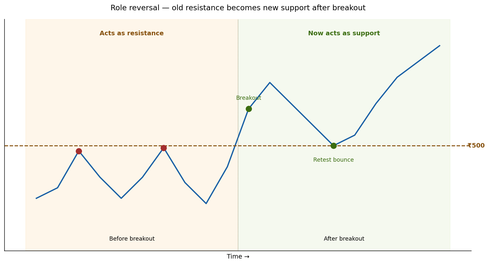

This **breakout → pullback → bounce** is one of the most reliable setups in technical analysis. Many professionals wait for the retest bounce rather than buying the initial breakout, because the retest *confirms* the role reversal.

### Worked example — HDFC Bank

Five observations over six months:

- Price touched ₹1,650 and bounced down (Jan)
- Price touched ₹1,655 and bounced down (Mar)
- Price touched ₹1,648 and bounced down (May)
- In June, price broke above ₹1,670 with **3× average volume**
- In July, price pulled back to ₹1,655 before rising to ₹1,720

**Reading:**
- **Resistance zone** at ~₹1,650 (three touches, 5 months, near round number)
- **Strong breakout** in June (volume confirmation from Tier 1 — 3× average means genuine demand)
- **Successful retest** in July at ₹1,655 confirms role reversal — old resistance is now confirmed support
- **Trend**: uptrend, with ₹1,650 as new dynamic floor

### Drawing levels in practice

1. Zoom out first — major levels on weekly/monthly are strongest
2. Find turning points (highs = potential resistance, lows = potential support)
3. Look for clusters (3–4 turning points at similar price = strong zone)
4. Draw lines through the cluster, treating it as a zone
5. Validate with round numbers if applicable

---

## Sidebar: Line charts vs candlestick charts

Throughout the diagrams above, line charts are used for clarity. **For real analysis, use candlesticks.** They preserve information line charts throw away:

1. **Wicks reveal real extremes** — a long lower wick at support shows aggressive intraday rejection that a line chart hides
2. **Body color shows who won** — a green close at support means buyers defended; a red close means sellers nearly broke through
3. **Wick patterns are signals themselves** — a "hammer" candle at support is one of the most reliable bounce signals

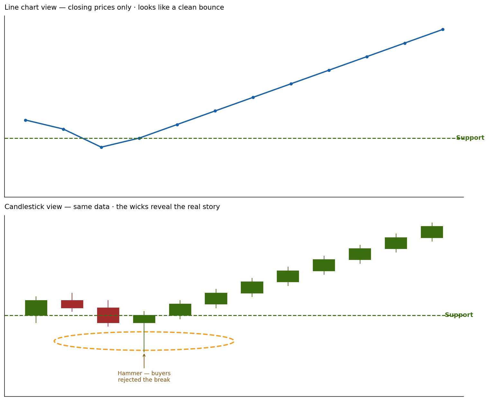

The line chart shows a gentle, uneventful bounce. The candlestick view reveals the truth: one candle pierced support intraday, but buyers slammed it back so hard it closed at the support line. That long lower wick is a major bullish signal.

### Which candle parts to use for drawing levels

Not all parts of a candle weigh equally:

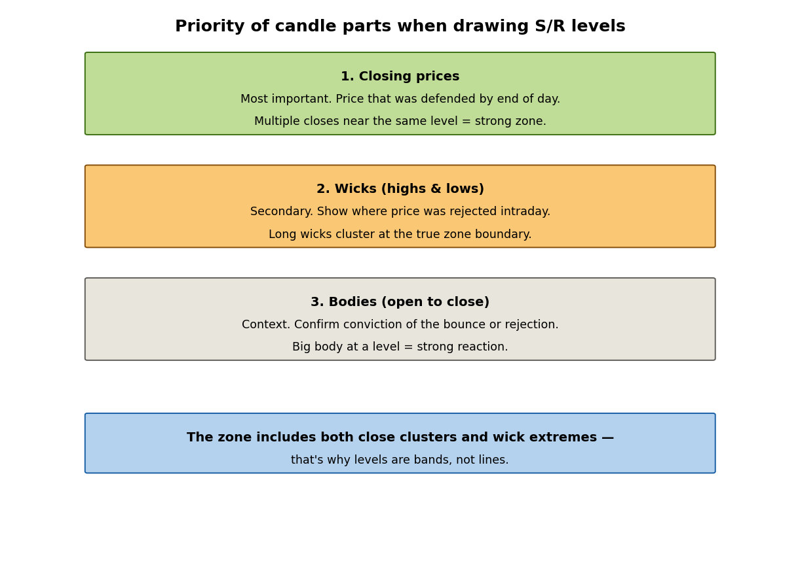

**Closes matter most.** They are the "settlement price" — committed verdicts at end of day. Multiple closes near the same price = strong zone.

**Wicks matter for reactions.** They show where price went but didn't stay. Long wicks cluster at the true zone boundary.

**Bodies matter for conviction.** Big body at a level = strong reaction. Small body = indecision.

**The full zone** is defined by both close clusters (the core) and wick extremes (the outer edge). That's why "wait for a close above resistance" is a more reliable rule than "wait for price to touch resistance."

### Practical rule

- For learning concepts → line charts work great (less noise)
- For actual trading → candlesticks (every Indian platform defaults to these)
- For very long timeframes (years/decades) → line charts can be cleaner

---

## 3. Moving Averages

### Intuition

Tracking your weight every day is noisy — water weight, what you ate, when you weighed in. But average the last 7 days and the real trend emerges. A moving average does this for stock prices: average the last N days, smooth out the chaos, see the underlying trend.

It's "moving" because the window slides forward each day — always averaging the *most recent* N days, dropping the oldest as a new day comes in.

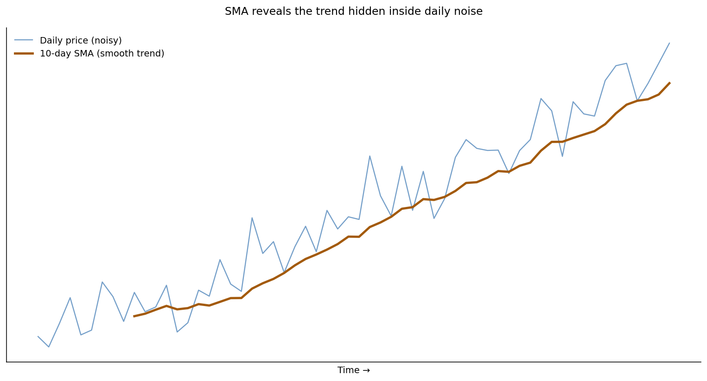

### Simple Moving Average (SMA) — the math

A **5-day SMA** example:

| Day | Close | 5-day SMA |
|---|---|---|
| 1 | 100 | — |
| 2 | 102 | — |
| 3 | 98 | — |
| 4 | 105 | — |
| 5 | 103 | (100+102+98+105+103)/5 = **101.6** |
| 6 | 107 | (102+98+105+103+107)/5 = **103.0** |
| 7 | 110 | (98+105+103+107+110)/5 = **104.6** |

On Day 6, Day 1 is dropped, Day 6 is added. The window slides.

### The window-length trade-off

| Window | Reaction speed | Reliability | Use |
|---|---|---|---|
| Short (10–20 day) | Fast | More false signals | Short-term trends, swing trading |
| Medium (50 day) | Medium | Balanced | Medium-term trends, position trading |
| Long (200 day) | Slow | Most reliable | Long-term trend, "is the stock healthy" filter |

The most-watched windows in the world: **20-day, 50-day, 200-day**. Their popularity makes them self-fulfilling — millions of traders watch them, so price often reacts at them.

### Two ways traders use moving averages

**Use 1: Trend filter.** The simplest rule in technical analysis:

- Price **above** its MA → uptrend → look for buying opportunities
- Price **below** its MA → downtrend → avoid buying or look for shorts

**Use 2: Dynamic support/resistance.** In an uptrend, price repeatedly pulls back to its MA, bounces, and continues higher. The MA acts as a **moving floor** — support that rises with the trend.

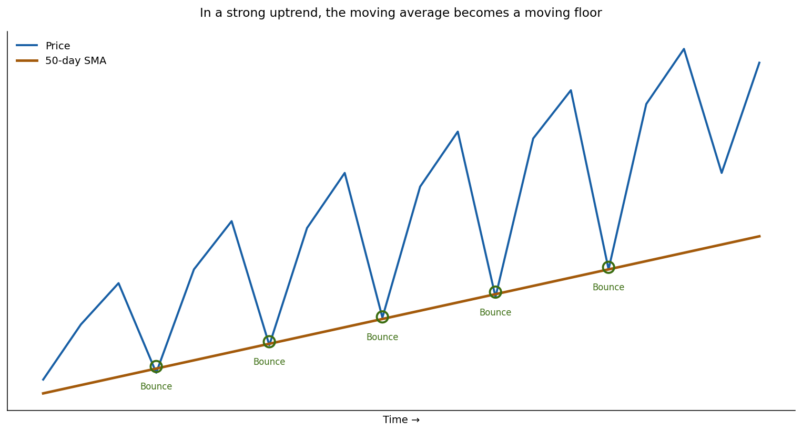

This is the classic "buying the dip" setup. The MA tells you where to enter — and where to exit if the trend breaks.

### EMA — Exponential Moving Average

The SMA weighs every day equally — yesterday and 20 days ago count the same. The **EMA** fixes this by weighting recent days more heavily, making it react faster.

| | SMA | EMA |
|---|---|---|
| Weighting | Equal for all days | Recent days weigh more |
| Reaction speed | Slower | Faster |
| Smoothness | Smoother | Slightly choppier |
| Best for | Long-term trend, less noise | Short-term trading, faster signals |

For learning, **start with SMA**. The 20/50/200-day SMAs are universally watched. EMA becomes useful when you want faster signals for active trading.

### Bullish alignment — the strongest trend signal

When you see this configuration:

```
Price > 50-day SMA > 200-day SMA   (all sloping up)
```

…you have **bullish alignment** (sometimes called "stacked moving averages"). It's one of the strongest possible trend signals because all three layers point the same direction:

- 50-day above 200-day → recent prices > older prices → momentum is accelerating
- Price above 50-day → today is leading the rally

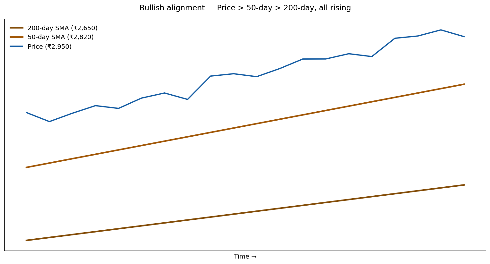

The opposite — Price < 50-day < 200-day, all sloping down — is **bearish alignment**, a strong "stay away" signal.

### Warning hierarchy — when is a trend in trouble?

Not all warning signals are equal:

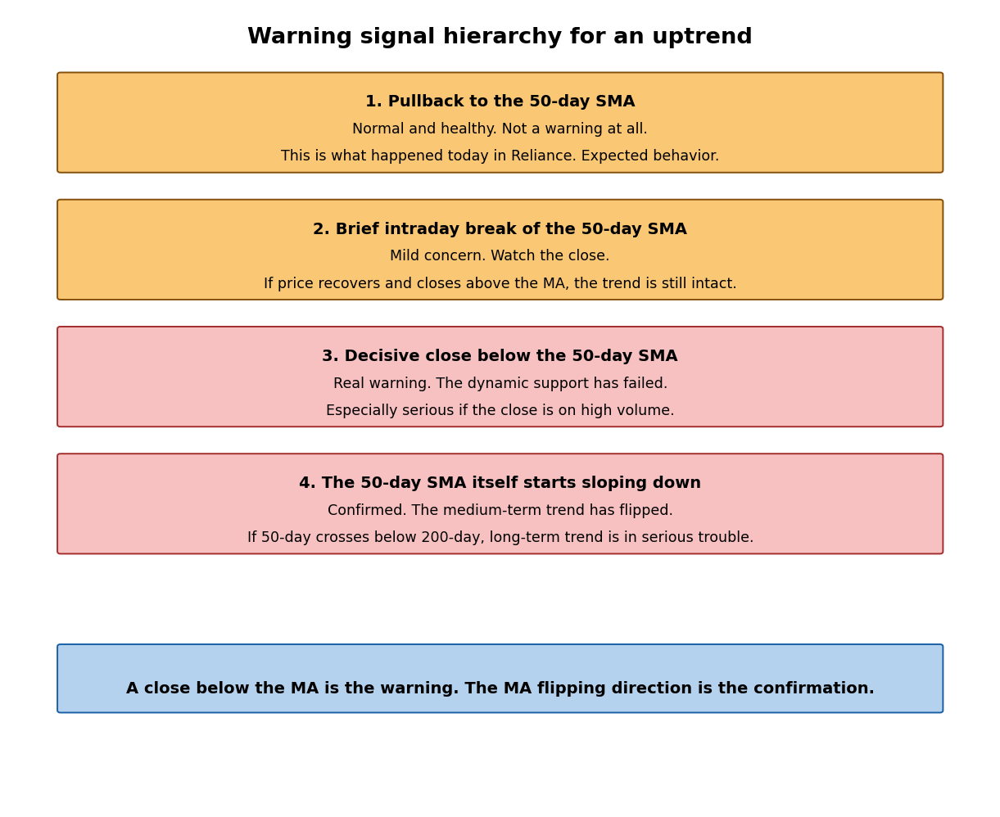

A pullback to the MA is healthy. A *close* below it is the warning. The MA *itself* changing direction is the confirmation. Notice the consistent emphasis on **closes** rather than mere intraday breaks — wicks below MA happen all the time and don't matter much. Closes are the committed verdict.

### Note on futures

If you're trading stock futures (e.g., on NSE):

- **Use the cash stock chart for analysis.** It has years of clean data — no rollover gaps. The futures price tracks cash within a tiny basis, so the chart shape is virtually identical.
- **Execute in the near-month future.** Get the leverage benefit on the same view.
- **Don't try to compute a 50-day MA on a single futures contract** — most contracts only live ~30 days. Either use the continuous futures chart (stitched series) or just use cash.

The MA window depends on **your holding period**, not the instrument:

| Holding period | Suitable MA |
|---|---|
| Hours (intraday) | 5/9/20-period on hourly or 15-min |
| 3–15 days (swing) | 10 and 20-day SMA on daily |
| Weeks to months (positional) | 50-day SMA primary, 20-day faster |
| Months to years (long-term) | 50/200-day on daily, or weekly MAs |

---

## 4. RSI — Relative Strength Index

This is your first **momentum indicator**. Trend, support/resistance, and MAs tell you about *direction*. RSI tells you about *exhaustion*: how strong is the current move, and is it getting tired?

### Intuition

A runner sprints fast at first but eventually tires. Their stride shortens, even though they're still moving forward. Stocks behave similarly — a stock can still be in an uptrend but, after a 30% rally in two weeks, be "tired." A pause or pullback is likely.

### What RSI measures

RSI compares the average size of **up-day gains** to the average size of **down-day losses** over a recent window (typically 14 days).

- Up-days much bigger than down-days → buyers dominating → RSI high
- Down-days much bigger than up-days → sellers dominating → RSI low
- Balanced → RSI in the middle

The result is a single number from **0 to 100**.

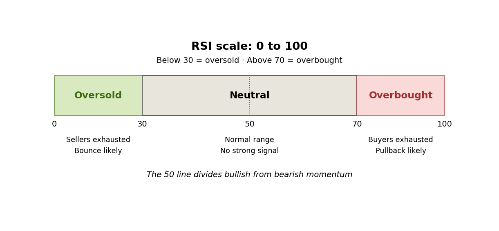

### The three zones

| Zone | RSI value | Meaning |
|---|---|---|
| **Oversold** | Below 30 | Sellers exhausted. Bounce more likely than another big drop. |
| **Neutral** | 30–70 | Normal trading. No strong signal from RSI alone. |
| **Overbought** | Above 70 | Buyers exhausted. Pullback more likely than another big surge. |

The **50 line** divides bullish from bearish momentum.

### Critical: what overbought/oversold actually mean

- **Overbought ≠ "sell now."** It means: the stock has risen so much that a pause is *more likely* than another big surge.
- **Oversold ≠ "buy now."** It means: the stock has fallen so much that a bounce is *more likely* than another big drop.

> **A stock can stay overbought for weeks** in a strong uptrend. Selling just because RSI hit 75 is a classic beginner mistake. RSI sits at 75–85 for entire rallies.

### Three ways traders use RSI

**Use 1 — Confirming exhaustion at S/R levels.** RSI is a *companion* to other analysis, not a standalone signal. A stock approaching support with RSI also oversold = two signals saying "bounce likely." Higher conviction.

**Use 2 — The 50 line as a trend filter.** In a strong uptrend, RSI typically oscillates 40–80, rarely below 50. In a strong downtrend, RSI typically oscillates 20–60, rarely above 50. Failure of RSI to hold 50 on pullbacks = momentum shifting.

**Use 3 — Divergence (most powerful).**

- **Bearish divergence** — price makes a higher high, RSI makes a *lower* high. Price still rising, but underlying momentum is fading. Early warning of trend reversal.
- **Bullish divergence** — price makes a lower low, RSI makes a *higher* low. Price still falling, but selling pressure is weakening. Often signals coming reversal upward.

### Why divergence works (the conceptual key)

You might wonder: *if price is rising, shouldn't RSI rise too?*

The hidden assumption is "rising price = rising gains." That's true day-to-day, but not over multi-week rallies. **RSI isn't cumulative — it's a rolling 14-day snapshot of recent gains vs. losses.**

Concrete example. Two rallies in the same stock:

| Rally 1 (early, fresh) | Rally 2 (late, tired) |
|---|---|
| +15, +12, -3, +18, +14 | +4, +3, -2, +5, +3 |
| Net: +56 | Net: +13 |
| RSI ~ 84 | RSI ~ 62 |

Both push price higher (new highs in both). But the *size* of recent gains has shrunk. **Price made higher highs. RSI made lower highs.** That's bearish divergence.

> **Better mental model:**
> Price = your bank balance (cumulative — keeps growing if you save)
> RSI = your monthly savings rate (a recent measurement — can go down even while balance hits new highs)

Your December balance can be at an all-time high while your savings rate plummets. Both true at once. That's exactly what bearish divergence looks like.

### Standard settings

**14-period RSI** is the universal default. Some traders use 9 or 7 for faster signals, 21 or 28 for smoother ones. Stick with 14.

### When RSI fails

- Bad in strong trends (can stay overbought for months)
- Never use alone — combine with trend, support/resistance, volume
- Best in range-bound markets where price oscillates between support and resistance

### Buying an oversold stock — checklist

Never buy just because RSI is below 30. The friend who says "RSI oversold, time to buy!" is a classic beginner. The right framework:

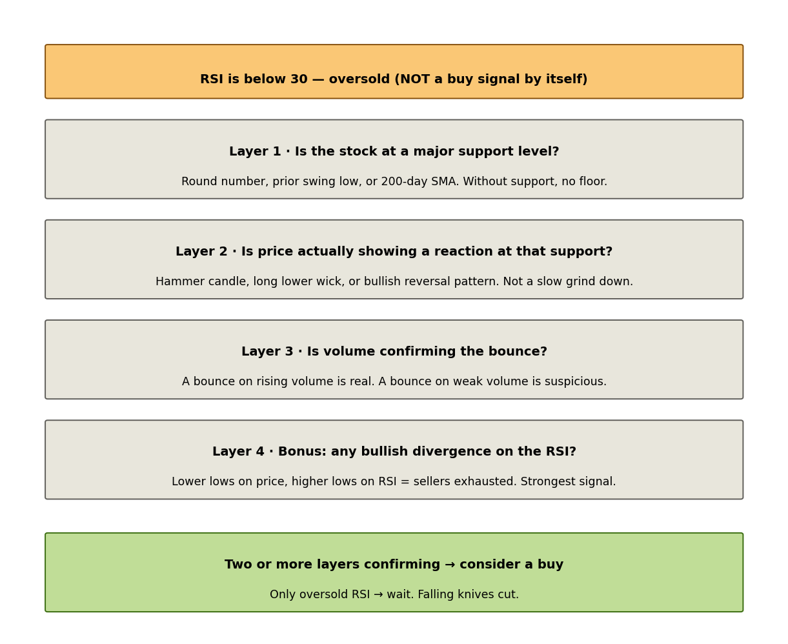

In a strong downtrend, RSI can stay oversold for weeks while the stock keeps falling. **Never catch a falling knife.** Reach for a falling stock only when at least 2–3 confirming layers are in place.

---

## 5. MACD — Moving Average Convergence Divergence

The most popular momentum indicator in the world. Sounds intimidating, is actually a clever combination of things you already understand.

### Intuition

What if you compared a fast and slow moving average? When momentum surges:

- Fast MA (12-day EMA) reacts quickly → climbs sharply
- Slow MA (26-day EMA) reacts slowly → still catching up
- The gap between them widens

When momentum fades, the gap narrows, closes, then flips negative.

**MACD is the measurement of that gap** — and from this simple comparison, you get a remarkable amount of information.

The full name unpacks:
- **Moving Average** — uses two EMAs
- **Convergence** — when they come together (momentum fading)
- **Divergence** — when they spread apart (momentum strengthening)

### Three components

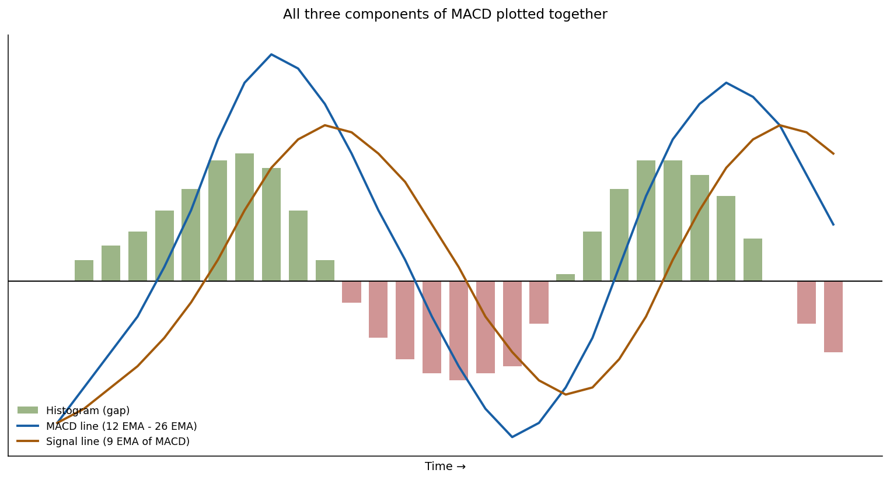

**1. The MACD line** = (12-day EMA) − (26-day EMA)
- Above zero → 12-day above 26-day → short-term momentum bullish
- Below zero → bearish
- Rising → gap widening → momentum accelerating
- Falling → gap narrowing → momentum decelerating

**2. The signal line** = 9-day EMA of the MACD line itself
- Smoothed, lags the MACD line
- Used as the "trigger" for crossover signals

**3. The histogram** = MACD line − signal line (the gap between them)
- Tall bars → strong momentum
- Shrinking bars → momentum fading
- Same information as the lines, but the *speed* of momentum changes is visually obvious

### Four MACD signals

**Signal 1: Crossover (basic entry signal)**
- MACD above signal line → bullish crossover → entry
- MACD below signal line → bearish crossover → exit/short

> **Caveat:** Crossovers fail in choppy/sideways markets ("whipsaw") — many false signals. They work best in clear trends.

**Signal 2: Zero-line cross (trend confirmer)**
- MACD crosses above zero → 12-day EMA crossed above 26-day EMA → short-term *trend* has flipped bullish
- MACD crosses below zero → trend flipped bearish

> Zero-line cross is the *trend* signal. Signal-line cross is the *entry* signal. Strongest setups have both pointing the same way.

**Signal 3: Histogram momentum**
- Histogram bars getting **taller** → momentum building
- Bars **shorter but still positive** → momentum fading even before direction has changed
- Bars **flipping positive to negative** → momentum officially reversed

Watching the histogram often gives the earliest hint of momentum changes.

**Signal 4: Divergence (most powerful)**

Same logic as RSI divergence, often considered even more reliable on MACD:

- **Bullish MACD divergence** — price makes lower lows, MACD makes higher lows. Selling momentum exhausting.
- **Bearish MACD divergence** — price makes higher highs, MACD makes lower highs. Buying momentum fading.

### Standard settings

**MACD (12, 26, 9)** — the universal default. 12 = fast EMA, 26 = slow EMA, 9 = signal line. Don't change these without a specific reason.

### MACD vs RSI — when to use which

|  | RSI | MACD |
|---|---|---|
| Measures | Are recent gains/losses balanced? | Are short and medium trends aligned? |
| Scale | 0 to 100 (bounded) | Unbounded |
| Best signal | Overbought/oversold + divergence | Crossovers + zero-line + divergence |
| Best in | Range-bound markets | Trending markets |
| Reaction speed | Faster | Slightly slower |

They complement each other. Many traders use **both**: RSI for exhaustion at extremes, MACD for momentum shifts. When both fire the same signal, conviction is high.

### Critical distinction: zero-line cross ≠ divergence

These are **two separate concepts** and beginners conflate them:

- **Zero-line cross** = MACD line moves from negative to positive (or vice versa). A *trend* signal.
- **Divergence** = price and MACD moving in opposite directions over multiple peaks/troughs. A *momentum-vs-price disagreement* signal.

You can have one without the other. Use the names precisely.

---

## The meta-skill: confluence

If there's one principle to take away from Tier 2, it's this:

> **No single indicator gives you a trade. Confluence does.**

When multiple unrelated signals all point the same way, the trade has high conviction. When you only have one signal, you wait.

### Classic high-conviction long entry

Putting Tier 2 together — what a textbook setup looks like:

1. **Trend** — stock in uptrend (higher highs, higher lows)
2. **Moving averages** — bullish alignment (price > 50-SMA > 200-SMA, all rising)
3. **Support** — price pulled back to dynamic support (50-day SMA)
4. **RSI** — cooled from overbought to neutral (40–50 range)
5. **MACD** — histogram shrunk to near zero and starting to grow positive again, OR fresh bullish crossover

When all five align, that's confluence. Rarely do you get all five — three or four is realistic. The more layers, the higher the conviction.

This entire multi-signal framework is what Tier 2 has been building toward.

---

## Quick reference

### Vocabulary

| Term | Meaning |
|---|---|
| Higher high | New peak above the previous peak |
| Higher low | New trough above the previous trough |
| Lower high | New peak below the previous peak |
| Lower low | New trough below the previous trough |
| Pullback | Temporary counter-move within a trend |
| Breakout | Decisive move through a S/R level |
| Retest | Price returns to a broken level to confirm role reversal |
| Whipsaw | Repeated false signals in a choppy/sideways market |
| Bullish alignment | Price > 50-SMA > 200-SMA, all rising |
| Bearish alignment | Price < 50-SMA < 200-SMA, all falling |
| Dynamic support | Support that moves with price (e.g., a rising MA) |
| Divergence | Price and indicator moving in opposite directions over multiple peaks/troughs |
| Confluence | Multiple unrelated signals pointing the same way |

### Standard indicator settings

| Indicator | Standard setting |
|---|---|
| SMA | 20-day, 50-day, 200-day |
| EMA | 12-day, 26-day (used inside MACD); also 9, 21 |
| RSI | 14-period |
| MACD | (12, 26, 9) |

### Decision rules

| Scenario | Action |
|---|---|
| Stock in uptrend, price pulling to 50-SMA, RSI cooling to 40–50 | High-conviction continuation buy |
| Stock at new high, RSI/MACD making lower highs | Bearish divergence — tighten stops, don't add longs |
| Stock breaking support on high volume | Trend may be reversing — exit/avoid |
| RSI below 30 in strong downtrend | Don't buy — falling knife. Wait for confirmation. |
| MACD whipsawing in sideways market | Switch to RSI; ignore MACD until trend emerges |
| Old resistance broken on high volume, then retested | Classic role-reversal buy setup |

---

*End of Tier 2 reference.*